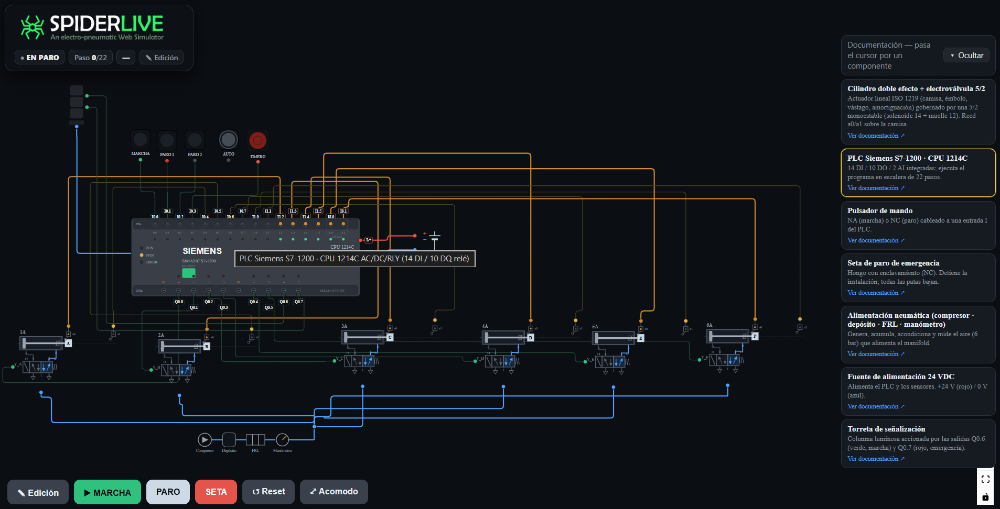

# SpiderLive Simulator



Simulador web **electroneumático** interactivo construido con **React + Vite + React Flow**.
Modela una "araña voladora" de feria: 6 cilindros neumáticos controlados por un PLC que ejecuta
una secuencia de 22 pasos (port de un programa en Texto Estructurado verificado).

Cada componente del circuito es un **nodo con puertos (handles)** y cada cable —eléctrico **y**
neumático— es una **arista (edge)** que React Flow rutea y mantiene conectada sola al mover los nodos.

## Cómo correrlo

Necesita **Node.js** instalado. En esta carpeta:

```bash
npm install      # instala React, Vite y React Flow (una sola vez)
npm run dev      # abre el servidor de desarrollo (http://localhost:5173)
```

Para una versión estática lista para publicar:

```bash
npm run build    # genera /dist
npm run preview  # sirve /dist localmente
```

## Características

- **Conexiones nativas**: los cables son edges entre handles; se reconectan solos al arrastrar
  los nodos, sin recalcular coordenadas a mano.
- **Pan / zoom / arrastrar** de fábrica (rueda + barra de Controls).
- **Aristas animadas y coloreadas por estado**: salida activa → verde brillante, sensor a1 → ámbar,
  aire → azul, alimentación → rojo/azul.
- Los **botones del panel** se pulsan y el PLC ejecuta la secuencia completa de 22 pasos.

## Estructura

```
src/
├─ engine.js     ← lógica pura del PLC (22 pasos)
├─ nodes.jsx     ← componentes-nodo (PLC, módulo cilindro+válvula, botones, FRL, 24 VDC, torreta)
├─ App.jsx       ← grafo (nodos + aristas), lazo de simulación, controles
└─ main.jsx
```

## Ideas para contribuir

- Cablear el sensor `a0` de cada cilindro (hoy solo se cablea `a1` como muestra; son ~6 edges más).
- Convertirlo en un **editor**: paleta de componentes con drag-and-drop y conexión libre
  (`onConnect` de React Flow ya da la base).
- Mejorar los símbolos gráficos de los nodos hacia norma ISO 1219 / IEC 60617.

Los pull requests son bienvenidos. Para cambios grandes, abre primero un issue para discutir
qué te gustaría cambiar.

## Licencia

[MIT](LICENSE)
